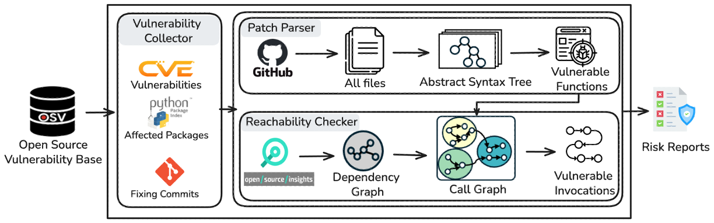

# PyVulAudit

[](https://www.python.org/downloads/)
[](LICENSE)
[](https://www.docker.com/)

PyVulAudit is a comprehensive tool for analyzing Python package vulnerabilities and their patches. It automatically collects vulnerability data from the OSV database, analyzes patch implementations, and performs reachability analysis to understand the impact of vulnerabilities in Python codebases. This tool is designed for security researchers, developers, and maintainers who need to assess vulnerability exposure and patch effectiveness in Python projects.



## 📋 Table of Contents

1. [Features](#-features)
2. [Requirements](#-requirements)
3. [Installation](#-installation)
4. [Quick Start](#-quick-start)
5. [Command Line Parameters](#-command-line-parameters)
6. [Usage Examples](#-usage-examples)
7. [Output Formats](#-output-formats)
8. [Architecture](#-architecture)
9. [Acknowledgments](#-acknowledgments)

## 🚀 Features

- **Vulnerability Collection**: Automated collection of vulnerability data from the OSV (Open Source Vulnerabilities) database
- **Patch Analysis**: Advanced multi-scope patch parsing and code change analysis using AST-based techniques
- **Reachability Analysis**: Intra-package call graph analysis to determine if vulnerable functions are reachable in downstream projects
- **Command-line Interface**: User-friendly CLI with comprehensive options

## 🛠 Installation

### Prerequisites

- **Python**: Version 3.9 or higher
- **Docker**: Required for containerized installation 
- **Chrome/Chromium**: Required for web scraping functionality
- **Git Personal Access Token** : Required for repository analysis
- **Memory**: Sufficient RAM recommended for call graph construction(configurable based on analysis scope; 32GB was used in our experiments)
- **Storage**: Sufficient disk space for vulnerability databases and analysis results

### Clone the Repository

```bash
git clone https://github.com/your-username/PyVulAudit.git
cd PyVulAudit
```

### Install Dependencies

Install the required Python packages:

```shell
pip install -r requirements.txt
```

### Install CG Tool

```shell
# JARVIS is required for call graph construction:
conda create -n jarvis python=3.9
conda activate jarvis
pip install -e JARVIS/tool/Jarvis_M/src
```

## 🚀 Quick Start

To get started with PyVulAudit, follow these simple steps:

1. **Run vulnerability collection**:
   ```bash
   python vulnerability_collector.py --collect
   ```

2. **Perform patch analysis**:

   ```bash
   python patch_parser.py --analyze
   ```

3. **Collect dependents and dependencies**:
   ```bash
   python collect_dependents_and_dependency.py --cve CVE-2023-24580 CVE-2020-13757
   ```

4. **install pkgs and generate call graph**

5. **Perform reachability analysis**:

   ```bash
   python reachability_checker.py --cve CVE-2014-0480 --force-update --rewrite-cg
   ```

## 📋 Command Line Parameters

PyVulAudit supports various command line parameters for vulnerability collection and analysis.

### Operation Modes

<table>
<thead>
  <tr>
    <th>Parameter</th>
    <th>Description</th>
  </tr>
</thead>
<tbody>
  <tr>
    <td><code>--collect</code></td>
    <td>Collect vulnerability data from OSV database</td>
  </tr>
  <tr>
    <td><code>--analyze</code></td>
    <td>Analyze patches and code changes for vulnerabilities</td>
  </tr>
  <tr>
    <td><code>--reachability</code></td>
    <td>Perform reachability analysis on vulnerable code paths</td>
  </tr>
</tbody>
</table>

### Configuration Options

<table>
<thead>
  <tr>
    <th>Parameter</th>
    <th>Type</th>
    <th>Description</th>
    <th>Default</th>
  </tr>
</thead>
<tbody>
  <tr>
    <td><code>--cve</code></td>
    <td>String(s)</td>
    <td>Specific CVE identifier(s) to analyze (can specify multiple)</td>
    <td>None</td>
  </tr>
  <tr>
    <td><code>--package</code></td>
    <td>String</td>
    <td>Specific package name to analyze vulnerabilities for</td>
    <td>None</td>
  </tr>
  <tr>
    <td><code>--output</code></td>
    <td>String</td>
    <td>Output file path for results</td>
    <td>data</td>
  </tr>
</tbody>
</table>


### Dependents Collection Parameters

The `collect_dependents_and_dependency.py` script supports the following parameters:

<table>
<thead>
  <tr>
    <th>Parameter</th>
    <th>Type</th>
    <th>Description</th>
    <th>Default</th>
  </tr>
</thead>
<tbody>
  <tr>
    <td><code>--cve</code></td>
    <td>String(s)</td>
    <td>Specific CVE identifier(s) to collect dependents for (supports multiple CVEs)</td>
    <td>None</td>
  </tr>
  <tr>
    <td><code>--package</code></td>
    <td>String(s)</td>
    <td>Specific package names to analyze (supports multiple packages)</td>
    <td>None</td>
  </tr>
  <tr>
    <td><code>--force-update</code></td>
    <td>Boolean</td>
    <td>Force update of existing cached data</td>
    <td>False</td>
  </tr>
  <tr>
    <td><code>--no-dependents-count-skip</code></td>
    <td>Integer</td>
    <td>Skip processing after N consecutive versions with no dependents</td>
    <td>-1 (no skip)</td>
  </tr>
  <tr>
    <td><code>--collect-dependency-graph</code></td>
    <td>Boolean</td>
    <td>Enable collection of dependency graphs for each dependent package</td>
    <td>False</td>
  </tr>
</tbody>
</table>

### Package Installation Parameters

The `install_pkg.py` script supports the following parameters for package installation and analysis:

<table>
<thead>
  <tr>
    <th>Parameter</th>
    <th>Type</th>
    <th>Description</th>
    <th>Default</th>
  </tr>
</thead>
<tbody>
  <tr>
    <td><code>--cve</code></td>
    <td>String(s)</td>
    <td>Specific CVE identifier(s) to analyze (supports multiple CVEs)</td>
    <td>None</td>
  </tr>
  <tr>
    <td><code>--package</code></td>
    <td>String(s)</td>
    <td>Specific package names to install and analyze (supports multiple packages)</td>
    <td>None</td>
  </tr>
  <tr>
    <td><code>--analyze-all</code></td>
    <td>Boolean</td>
    <td>Analyze all available CVEs and packages</td>
    <td>False</td>
  </tr>
  <tr>
    <td><code>--size</code></td>
    <td>Integer</td>
    <td>Limit the number of packages to process (for testing)</td>
    <td>None</td>
  </tr>
  <tr>
    <td><code>--workdir</code></td>
    <td>String</td>
    <td>Working directory for package installation</td>
    <td>../docker_workdir_new</td>
  </tr>
  <tr>
    <td><code>--snapshot-dir</code></td>
    <td>String</td>
    <td>Directory containing dependency snapshots</td>
    <td>data/icse_demo/snapshots</td>
  </tr>
  <tr>
    <td><code>--threads</code></td>
    <td>Integer</td>
    <td>Number of threads for parallel processing</td>
    <td>10</td>
  </tr>
  <tr>
    <td><code>--memory</code></td>
    <td>Integer</td>
    <td>Maximum memory allocation in GB</td>
    <td>32</td>
  </tr>
  <tr>
    <td><code>--force-update</code></td>
    <td>Boolean</td>
    <td>Force update of existing cached data</td>
    <td>False</td>
  </tr>
  <tr>
    <td><code>--only-py-list</code></td>
    <td>Boolean</td>
    <td>Only extract Python file lists without full installation</td>
    <td>False</td>
  </tr>
  <tr>
    <td><code>--save-installed</code></td>
    <td>Boolean</td>
    <td>Save information about successfully installed packages</td>
    <td>False</td>
  </tr>
  <tr>
    <td><code>--verbose</code></td>
    <td>Boolean</td>
    <td>Enable verbose output with detailed progress information</td>
    <td>False</td>
  </tr>
</tbody>
</table>

### Reachability Analysis Parameters

The `reachability_checker.py` script supports the following parameters for vulnerability reachability analysis:

<table>
<thead>
  <tr>
    <th>Parameter</th>
    <th>Type</th>
    <th>Description</th>
    <th>Default</th>
  </tr>
</thead>
<tbody>
  <tr>
    <td><code>--cve</code></td>
    <td>String(s)</td>
    <td>Specific CVE identifier(s) to analyze (supports multiple CVEs)</td>
    <td>None</td>
  </tr>
  <tr>
    <td><code>--package</code></td>
    <td>String(s)</td>
    <td>Specific package names to analyze (supports multiple packages)</td>
    <td>None</td>
  </tr>
  <tr>
    <td><code>--reachability</code></td>
    <td>Boolean</td>
    <td>Perform reachability analysis on all available CVEs</td>
    <td>False</td>
  </tr>
  <tr>
    <td><code>--force-update</code></td>
    <td>Boolean</td>
    <td>Force re-analysis of CVEs, ignoring existing cache</td>
    <td>False</td>
  </tr>
  <tr>
    <td><code>--rewrite-cg</code></td>
    <td>Boolean</td>
    <td>Force re-analysis of existing call graphs</td>
    <td>False</td>
  </tr>
  <tr>
    <td><code>--size</code></td>
    <td>String</td>
    <td>Analysis scope: 'small', 'medium', 'large', or 'all'</td>
    <td>all</td>
  </tr>
  <tr>
    <td><code>--output</code></td>
    <td>String</td>
    <td>Output directory for analysis results</td>
    <td>data</td>
  </tr>
  <tr>
    <td><code>--verbose</code></td>
    <td>Boolean</td>
    <td>Enable verbose output with detailed progress information</td>
    <td>False</td>
  </tr>
</tbody>
</table>

## 📖 Usage Examples

PyVulAudit provides several operation modes for different analysis needs. Here are practical examples for common use cases:

### 1. Vulnerability Collection

Collect vulnerability data from the OSV database:
```bash
python vulnerability_collector.py --collect
```

Expected output:
```
Starting vulnerability collection...

Results saved to:
  advisory: /path/to/data/icse_demo/cve2advisory.pkl

=== Overall Dataset Quality Statistics ===
Total CVEs collected: 3703
CVEs with commits: 2771
Total commits found: 3630
```

### 2. Analyzing Specific CVEs

Focus analysis on particular vulnerabilities:
```bash
python vulnerability_collector.py --collect --cve CVE-2020-13757
```

Expected output:

```
=== Analyzing Specific CVEs: ['CVE-2020-13757'] ===

--- CVE-2020-13757 ---
Summary: Python-RSA decryption of ciphertext leads to DoS...
Affected packages: 1
  - rsa: 23 versions, introduced: 0, fixed: 4.1
Commits found: 2
Commit URLs: ['https://github.com/sybrenstuvel/python-rsa/commit/3283b1284475cf6c79a7329aee8bd7443cc72672', 'https://github.com/sybrenstuvel/python-rsa/commit/93af6f2f89a9bf28361e67716c4240e691520f30']
```

### 4. Patch Analysis

Analyze patches for collected vulnerabilities:
```bash
python patch_parser.py --analyze --cve CVE-2023-24580 CVE-2020-13757
```

Expected output:
```
🔍 Starting patch analysis...
📊 Loading CVE data...
✅ Successfully loaded 3703 CVE records

📊 === CVE Dataset Statistics ===
📦 Total unique packages: 1228
🔢 Total CVEs: 3703
📈 Average packages per CVE: 1.34
========================================
🔍 Filtering by specified CVEs: ['CVE-2023-24580', 'CVE-2020-13757']
✅ 2 CVEs remaining after filtering
🔧 Starting patch analysis processing...
🚀 Starting patch analysis workflow...

📝 Step 1: Processing possible commit URLs...
✅ Processed commit information for 2 CVEs
   📊 Total packages processed: 2
   📊 Total commits found: 5
   📊 Average commits per package: 2.50

🔍 Step 2: Filtering and prioritizing commits...
✅ 2 CVEs remaining after filtering
📊 Filtering Statistics:
   - Packages after filtering: 2
   - Total commits after filtering: 5
   - Average commits per CVE: 2.50
   - Average commits per package: 2.50

🔬 Step 3: Analyzing code change scope...
✅ Completed scope analysis for 2 CVEs
📊 Scope Analysis Statistics:
   - CVEs with scope analysis: 2/2
   - Total VFCs (Vulnerable File Changes): 5
   - Total modified files: 17
   - Average VFCs per CVE: 2.50
   - Average modified files per CVE: 8.50

🎯 Step 4: Analyzing vulnerable functions...
✅ Completed vulnerable function analysis for 2 CVEs
📊 Vulnerable Function Analysis Statistics:
   - CVEs with vulnerable functions: 2/2
   - Total vulnerable functions: 13
   - Average functions per CVE: 6.50
   - Function types distribution:
     * old_method_direct_modified_by_deleted_lines: 9
     * old_method_only_modified_by_added_lines: 4

📊 Step 5: Evaluating analysis results...
📊 === Vulnerable Functions Overall Statistics ===
   - Total CVEs: 2
   - Total packages: 2
   - Total VFCs: 5
   - Total vulnerable functions: 13

📊 === CVE-level Function Statistics ===
   - CVEs with extractable functions: 2/2 (100.0%)
   - CVEs without extractable functions: 0/2 (0.0%)
   - Average functions per CVE: 6.50

📊 === VFC-level Function Statistics ===
   - VFCs with extractable functions: 5/5 (100.0%)
   - VFCs without extractable functions: 0/5 (0.0%)
   - Average functions per VFC: 2.60

📊 === Top Function Extraction Strategies ===
   1. old_method_direct_modified_by_deleted_lines:
      - Functions: 9 (69.2%)
      - CVE coverage: 1 (50.0%)
      - VFC coverage: 3 (60.0%)
   2. old_method_only_modified_by_added_lines:
      - Functions: 4 (30.8%)
      - CVE coverage: 1 (50.0%)
      - VFC coverage: 2 (40.0%)

✅ Vulnerable function evaluation completed
💾 Saving evaluation results...
✅ Evaluation results saved to /path/to/data/icse_demo/evaluation_results.json
🏁 Patch analysis workflow completed!
```

The analysis includes:
- **Step 1**: Processing commit URLs from vulnerability databases
- **Step 2**: Filtering and prioritizing relevant commits
- **Step 3**: AST-based code change scope analysis
- **Step 4**: Vulnerable function identification using multiple extraction strategies
- **Step 5**: Comprehensive statistical evaluation and result aggregation

### 5. Dependents and Dependencies Collection

Collect dependents and dependency information for vulnerable packages:
```bash
python src/collect_dependents_and_dependency.py --cve CVE-2023-24580 CVE-2020-13757
```

Expected output:
```
🚀 Starting dependents and dependency collection
📊 Loading CVE advisory data...
✅ Successfully loaded 2281 CVE records
🔍 Filtering by specified CVEs: ['CVE-2023-24580', 'CVE-2020-13757']
✅ 2 CVEs remaining after filtering
🔄 Processing CVE CVE-2020-13757 (1/2)
🔍 Processing CVE: CVE-2020-13757
📁 Dependents file: /path/to/data/icse_demo/dependents/CVE-2020-13757.json
🔄 Processing CVE CVE-2023-24580 (2/2)
🔍 Processing CVE: CVE-2023-24580
📁 Dependents file: /path/to/data/icse_demo/dependents/CVE-2023-24580.json
📊 CVE CVE-2023-24580: 43 direct + 1 indirect = 44 total dependents
✅ Successfully processed 2 CVEs with dependents
💾 Results saved to /path/to/data/icse_demo/cve_dependents_results.json
🔧 ChromeDriver closed
🔚 WebDriver closed, execution completed
```

**Additional Options:**

Collect dependents with their dependency graphs for deeper analysis:
```bash
python src/collect_dependents_and_dependency.py --cve CVE-2023-24580 --collect-dependency-graph
```

### 6. Package Installation and Analysis

Install and analyze packages for specific CVE:
```bash
python src/install_pkg.py --cve CVE-2020-13757
```

Expected output:

```
📊 Loading CVE data from: /path/to/data/icse_demo/cve2advisory_enhanced.pkl
✅ Loaded 2281 CVEs from advisory file
🔍 Filtering for specific CVEs: ['CVE-2020-13757']
  ✅ Found CVE: CVE-2020-13757
📋 Filtered to 1 CVEs

🔄 Step 1: Analyzing downstream and upstream package relationships
🔍 Generating downstream and pairs data from dependency graphs
💾 Saving pairs data to cache: ../docker_workdir_new/get_all_downstream_and_pairs_results.pkl
📊 Found 59 downstream packages and 2 upstream packages
🔗 Total CVE-package pairs: 2

🔄 Step 2: Collecting metadata for packages
📦 Target packages: 2 upstream, 59 downstream
📂 Loading cached metadata results
🧹 Filtering out failed packages:
  ❌ Failed downstream: 13
  ❌ Failed upstream: 0
✅ Successfully collected metadata:
  📦 Upstream packages: 2
  📦 Downstream packages: 59

🔄 Step 3: Generating installation tasks
💾 Installation tasks saved to:
  📄 Downstream: ../docker_workdir_new/install_tasks.json
  📄 Upstream: ../docker_workdir_new/install_tasks_for_upstream.json
📖 Reading installation task files
📊 Installation tasks summary:
  📦 Downstream: 99466 total tasks
  📦 Upstream: 619463 total tasks

🔄 Step 4: Collecting Python file structures
📂 Loading cached Python file data
🐍 Packages with Python files:
  📦 Upstream: 2/2
  📦 Downstream: 53/59

🔄 Step 5: Normalizing package functions and filtering
📊 Filtering results:
  📦 Upstream filtered: 2
  📦 Downstream filtered: 53
  🔗 Filtered CVE pairs: 1
💾 Saving filtered pairs to: ../docker_workdir_new/filtered_pairs.pkl

🔄 Step 6: Full package installation with dependencies
✅ Processing complete!
```

**Note**: **package installation with dependencies** will take several hours and requires significant memory and storage.

### 7. Reachability Analysis

Perform reachability analysis to determine if vulnerable functions are reachable in downstream projects:
```bash
python reachability_checker.py --cve CVE-2020-13757
```

Expected output:
```
🔍 Upstream Package: rsa@3.1.4
   Total downstream packages: 1
   Reachable packages: 1
   Reachable package list:
        - awscli@1.7.35
          🎯 Vulnerable invocations (1):
            - awscli.customizations.ec2decryptpassword.LaunchKeyArgument._decrypt_password_data

🔍 Upstream Package: rsa@3.4.2
   Total downstream packages: 58
   Reachable packages: 3
   Reachable package list:
        - agutil@2.0.0
          🎯 Vulnerable invocations (5):
            - agutil.security.src.securesocket.SecureSocket.recvRSA
            - agutil.security.src.securesocket.SecureSocket.recv
            - agutil.security.src.securesocket.SecureSocket.recvAES
            ... and 2 more invocations
        - morango@0.0.2
          🎯 Vulnerable invocations (1):
            - morango.crypto.PythonRSAKey._verify
        - awscli@1.15.85
          🎯 Vulnerable invocations (6):
            - awscli.customizations.ec2.decryptpassword.LaunchKeyArgument._decrypt_password_data
            - awscli.customizations.cloudtrail.validation.CloudTrailValidateLogs._run_main
            - awscli.customizations.cloudtrail.validation.Sha256RSADigestValidator.validate
            ... and 3 more invocations
```

**Additional Options:**

Display the shortest paths from vulnerable invovations to vulnerable functions :

```bash
python reachability_checker.py --cve CVE-2020-13757 --show-paths
```

## 🏗 Architecture

PyVulAudit follows a modular architecture with the following core components:

### Core Modules

#### 1. VulnerabilityCollector (`vulnerability_collector.py`)
- **Purpose**: Collects and processes vulnerability data from OSV database
- **Key Features**:
  - Downloads OSV database for Python packages
  - Filters and transforms vulnerability records
  - Extracts affected package versions and metadata
  - Identifies potential fix commits from GitHub repositories
- **Output**: CVE-to-advisory mappings with package and version information

#### 2. PatchParser (`patch_parser.py`)
- **Purpose**: Analyzes patches and code changes for vulnerability fixes
- **Key Features**:
  - Clones repositories and analyzes commit history
  - Performs AST-based code change analysis
  - Identifies vulnerable functions and methods
  - Extracts scope information (class, function, module level changes)
- **Output**: Detailed code change analysis with vulnerable function identification

#### 3. ReachabilityChecker (`reachability_checker.py`)
- **Purpose**: Determines if vulnerable functions are reachable in downstream projects
- **Key Features**:
  - Constructs call graphs for Python packages using JARVIS
  - Analyzes import relationships and function calls
  - Computes reachability from entry points to vulnerable functions
- **Output**: Reachability analysis results with detailed call paths

#### 5. Supporting Components


- **Constants** (`constant.py`): Centralized configuration and path management
- **Snapshot Creator** (`create_snapshot.py`): Creates reproducible analysis snapshots
- **Dependents and Dependency Collector** (`collect_dependents_and_dependency.py`): Collects package dependents and dependency graphs using deps.dev API and web scraping
- **Package Installation Manager** (`install_pkg.py`): Docker-based environment analyzer for safe package installation, dependency analysis, and call graph generation

## 🙏 Acknowledgments

- [OSV (Open Source Vulnerabilities)](https://osv.dev/): For providing a comprehensive database of security advisories.
- [OSI(Open Source Insignts)](https://github.com/google/deps.dev): For enabling the dependency analysis of software ecosystems.
- [PyDriller](https://github.com/ishepard/pydriller): For its capabilities in Git repository analysis.
- [JARVIS](https://github.com/pythonJaRvis/pythonJaRvis.github.io): For its capabilities in Python Call Graph construction.
- [Tree-sitter](https://github.com/tree-sitter): For its ess- The Python security community for their ongoing efforts.
edication and collaborative efforts.

