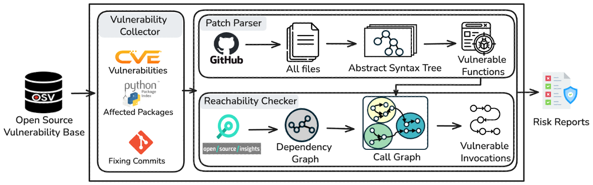

# PyVulAudit

[](https://www.python.org/downloads/)
[](LICENSE)
[](https://www.docker.com/)

PyVulAudit is a comprehensive tool for analyzing Python package vulnerabilities and their patches. It automatically collects vulnerability data from the OSV database, analyzes patch implementations, and performs reachability analysis to understand the impact of vulnerabilities in Python codebases. This tool is designed for security researchers, developers, and maintainers who need to assess vulnerability exposure and patch effectiveness in Python projects.



## 🚀 Features

- **Vulnerability Collection**: Automated collection of vulnerability data from the OSV (Open Source Vulnerabilities) database
- **Patch Analysis**: Advanced multi-scope patch parsing and code change analysis using AST-based techniques
- **Reachability Analysis**: Intra-package call graph analysis to determine if vulnerable functions are reachable in downstream projects
- **Command-line Interface**: User-friendly CLI with comprehensive options

## 📋 Table of Contents

1. [Features](#features)
2. [Requirements](#requirements)
3. [Installation](#installation)
4. [Quick Start](#quick-start)
5. [Command Line Parameters](#command-line-parameters)
6. [Usage Examples](#usage-examples)
7. [Output Formats](#output-formats)
8. [Architecture](#architecture)
9. [Contributing](#contributing)
10. [License](#license)

## 🚀 Quick Start

To get started with PyVulAudit, follow these simple steps:

1. **Run vulnerability collection**:
   ```bash
   python src/run.py --collect --size 100
   ```

2. **Analyze patches**:
   ```bash
   python src/run.py --analyze
   ```

3. **Perform reachability analysis**:
   ```bash
   python src/run.py --reachability
   ```

4. **Run full analysis pipeline**:
   ```bash
   python src/run.py --full --size 50 --output results.json
   ```

## 📋 Command Line Parameters

PyVulAudit supports various command line parameters for different analysis modes and configurations.

### Operation Modes (Mutually Exclusive)

<table>
<thead>
  <tr>
    <th>Parameter</th>
    <th>Description</th>
  </tr>
</thead>
<tbody>
  <tr>
    <td><code>--collect</code></td>
    <td>Collect vulnerability data from OSV database</td>
  </tr>
  <tr>
    <td><code>--analyze</code></td>
    <td>Analyze patches and code changes for vulnerabilities</td>
  </tr>
  <tr>
    <td><code>--reachability</code></td>
    <td>Perform reachability analysis on vulnerable code paths</td>
  </tr>
  <tr>
    <td><code>--full</code></td>
    <td>Run complete analysis pipeline (collect + analyze + reachability)</td>
  </tr>
</tbody>
</table>

### Configuration Options

<table>
<thead>
  <tr>
    <th>Parameter</th>
    <th>Type</th>
    <th>Description</th>
    <th>Default</th>
  </tr>
</thead>
<tbody>
  <tr>
    <td><code>--cve</code></td>
    <td>String</td>
    <td>Specific CVE identifier to analyze</td>
    <td>None</td>
  </tr>
  <tr>
    <td><code>--size</code></td>
    <td>Integer</td>
    <td>Number of vulnerabilities to process</td>
    <td>All available</td>
  </tr>
  <tr>
    <td><code>--log-level</code></td>
    <td>String</td>
    <td>Logging level (DEBUG, INFO, WARNING, ERROR)</td>
    <td>INFO</td>
  </tr>
  <tr>
    <td><code>--output</code></td>
    <td>String</td>
    <td>Output file path for JSON results</td>
    <td>None</td>
  </tr>
</tbody>
</table>

### Usage Examples

Display help information:
```bash
python src/run.py --help
```

Analyze a specific CVE:
```bash
python src/run.py --collect --cve CVE-2023-12345
```

Run analysis with debug logging:
```bash
python src/run.py --full --log-level DEBUG --output debug_results.json
```

## ✨ Features

- **Vulnerability Collection**: Automatically downloads and processes vulnerability data from the OSV (Open Source Vulnerabilities) database
- **Patch Analysis**: Analyzes code changes and patches related to vulnerability fixes using AST-based techniques
- **Reachability Analysis**: Determines if vulnerable code paths are reachable in target applications
- **Multi-mode Operation**: Supports individual analysis modes (collect, analyze, reachability) or full pipeline execution
- **Flexible Output**: Generates JSON reports and summary statistics for further analysis
- **Docker Support**: Containerized execution environment for consistent analysis
- **Configurable Logging**: Multiple log levels for debugging and monitoring

## 📋 Requirements

- **Python**: Version 3.8 or higher
- **Docker**: Required for containerized analysis (optional but recommended)
- **Chrome/Chromium**: Required for web scraping functionality
- **Git**: Required for repository analysis
- **Memory**: At least 4GB RAM recommended for large-scale analysis
- **Storage**: Sufficient disk space for vulnerability databases and analysis results

## 🛠 Installation

### Prerequisites

- Python 3.8 or higher
- Git
- Docker (for package analysis)
- Chrome/Chromium browser (for dependency collection)

### Clone the Repository

```bash
git clone https://github.com/your-username/PyVulAudit.git
cd PyVulAudit
```

### Install Dependencies

Install the required Python packages:

```shell
pip install -r requirements.txt
```

### Install JARVIS

JARVIS is required for call graph construction:

```shell
git clone https://github.com/your-username/jarvis_cg.git JARVIS
pip install -e JARVIS/tool/Jarvis_M/src
```

### Setup

1. Ensure Docker is running on your system
2. Chrome/Chromium Driver should be installed for dependency collection
3. Create necessary data directories:

```bash
mkdir -p data logs
```


## 📖 Usage Examples

PyVulAudit provides several operation modes for different analysis needs. Here are practical examples for common use cases:

### 1. Basic Vulnerability Collection

Collect the latest 50 vulnerabilities from the OSV database:
```bash
python src/run.py --collect --size 50
```

Expected output:
```
Starting vulnerability collection...
Downloaded OSV database: 15,234 vulnerabilities found
Filtering Python-related vulnerabilities...
Collected 50 vulnerabilities for analysis
Results saved to: data/vulnerabilities.json
```

### 2. Analyzing a Specific CVE

Focus analysis on a particular vulnerability:
```bash
python src/run.py --collect --cve CVE-2023-40217
```

This will:
- Download data for the specific CVE
- Extract patch information
- Identify affected packages and versions

### 3. Patch Analysis Workflow

Analyze patches for previously collected vulnerabilities:
```bash
python src/run.py --analyze --log-level DEBUG
```

The analysis includes:
- AST-based code change detection
- Commit message analysis
- Patch complexity assessment
- Security fix pattern identification

### 4. Reachability Analysis

Determine if vulnerabilities are reachable in target codebases:
```bash
python src/run.py --reachability --output reachability_report.json
```

This performs:
- Call graph construction
- Path analysis from entry points
- Vulnerability exposure assessment

### 5. Complete Analysis Pipeline

Run the full analysis workflow:
```bash
python src/run.py --full --size 25 --output complete_analysis.json --log-level INFO
```

Pipeline stages:
1. **Collection**: Download vulnerability data
2. **Analysis**: Process patches and code changes  
3. **Reachability**: Assess vulnerability exposure
4. **Reporting**: Generate comprehensive JSON report

### 6. Large-Scale Analysis

For research or comprehensive auditing:
```bash
python src/run.py --full --size 500 --output large_scale_analysis.json
```

**Note**: Large-scale analysis may take several hours and requires significant memory and storage.

## 📊 Output Formats

PyVulAudit generates various output formats depending on the analysis mode and configuration.

### Console Output

During execution, PyVulAudit provides real-time progress information:

```
Starting vulnerability collection...
[INFO] Downloading OSV database...
[INFO] Processing 1,234 vulnerabilities...
[████████████████████████████████] 100% Complete
[INFO] Found 156 Python-related vulnerabilities
[INFO] Collected vulnerability data for 50 packages
[INFO] Analysis completed in 2m 34s

Summary Statistics:
- Total vulnerabilities processed: 50
- Packages analyzed: 23
- Patches found: 45
- Reachable vulnerabilities: 12
```

### JSON Output Format

When using the `--output` parameter, results are saved in structured JSON format:

```json
{
  "metadata": {
    "analysis_date": "2024-01-15T10:30:00Z",
    "tool_version": "1.0.0",
    "analysis_mode": "full",
    "total_vulnerabilities": 50,
    "processing_time": "154.2s"
  },
  "vulnerabilities": [
    {
      "cve_id": "CVE-2023-40217",
      "package": "urllib3",
      "affected_versions": ["<2.0.5"],
      "severity": "HIGH",
      "patch_info": {
        "commit_hash": "abc123def456",
        "files_changed": ["src/urllib3/util/ssl_.py"],
        "lines_added": 15,
        "lines_removed": 8
      },
      "reachability": {
        "is_reachable": true,
        "entry_points": ["main.py:45", "api/handler.py:123"],
        "call_depth": 3
      }
    }
  ],
  "summary": {
    "total_packages": 23,
    "high_severity": 12,
    "medium_severity": 28,
    "low_severity": 10,
    "reachable_count": 12,
    "patched_count": 45
  }
}
```

### Log Files

Detailed logs are saved in the `logs/` directory:

- `pyVulAudit.log`: Main application log
- `collection.log`: Vulnerability collection details
- `analysis.log`: Patch analysis results
- `reachability.log`: Reachability analysis details

### Data Files

Analysis generates several data files in the `data/` directory:

- `vulnerabilities.json`: Raw vulnerability data from OSV
- `patches.json`: Extracted patch information
- `call_graphs.json`: Generated call graph data
- `reachability_results.json`: Reachability analysis results

### Interpreting Results

#### Vulnerability Severity Levels
- **CRITICAL**: Immediate action required, actively exploited
- **HIGH**: Significant security risk, patch immediately
- **MEDIUM**: Moderate risk, plan patching soon
- **LOW**: Minor risk, patch during regular maintenance

#### Reachability Status
- **Reachable**: Vulnerable code can be executed from application entry points
- **Potentially Reachable**: May be reachable under certain conditions
- **Not Reachable**: Vulnerable code is not accessible from entry points
- **Unknown**: Analysis could not determine reachability

#### Patch Analysis Metrics
- **Complexity Score**: 1-10 scale indicating patch complexity
- **Security Pattern**: Type of security fix (input validation, bounds checking, etc.)
- **Test Coverage**: Whether the patch includes test cases
- **Documentation**: Whether the fix is properly documented

## 🏗 Architecture

PyVulAudit follows a modular architecture with the following core components:

### Core Modules

#### 1. VulnerabilityCollector (`vulnerability_collector.py`)
- **Purpose**: Collects and processes vulnerability data from OSV database
- **Key Features**:
  - Downloads OSV database for Python packages
  - Filters and transforms vulnerability records
  - Extracts affected package versions and metadata
  - Identifies potential fix commits from GitHub repositories
- **Output**: CVE-to-advisory mappings with package and version information

#### 2. PatchParser (`patch_parser.py`)
- **Purpose**: Analyzes patches and code changes for vulnerability fixes
- **Key Features**:
  - Clones repositories and analyzes commit history
  - Performs AST-based code change analysis
  - Identifies vulnerable functions and methods
  - Extracts scope information (class, function, module level changes)
- **Output**: Detailed code change analysis with vulnerable function identification

#### 3. ReachabilityChecker (`reachability_checker.py`)
- **Purpose**: Determines if vulnerable functions are reachable in downstream projects
- **Key Features**:
  - Constructs call graphs for Python packages using JARVIS
  - Analyzes import relationships and function calls
  - Computes reachability from entry points to vulnerable functions
- **Output**: Reachability analysis results with detailed call paths

#### 4. Main Orchestrator (`run.py`)
- **Purpose**: Provides unified CLI interface and orchestrates the analysis workflow
- **Key Features**:
  - Command-line argument parsing and validation
  - Workflow coordination between different analysis phases
  - Result aggregation and output formatting
  - Logging and error handling

### Data Flow

```
1. OSV Database → VulnerabilityCollector → CVE Records
2. CVE Records → PatchParser → Code Changes & Vulnerable Functions  
3. Vulnerable Functions + Call Graphs → ReachabilityChecker → Reachability Results
4. All Results → Main Orchestrator → Final Output (JSON)
```

### Supporting Components

- **Environment Analyzer** (`install_pkg.py`): Manages package installation and environment setup
- **Constants** (`constant.py`): Centralized configuration and path management
- **Snapshot Creator** (`create_snapshot.py`): Creates reproducible analysis snapshots
- **Data Classes**: Structured data representations for packages and vulnerabilities

## 🙏 Acknowledgments

- [OSV (Open Source Vulnerabilities)](https://osv.dev/): For providing a comprehensive database of security advisories.
- [OSI(Open Source Insignts)](https://github.com/google/deps.dev): For enabling the dependency analysis of software ecosystems.
- [PyDriller](https://github.com/ishepard/pydriller): For its capabilities in Git repository analysis.
- [JARVIS](https://github.com/pythonJaRvis/pythonJaRvis.github.io): For its capabilities in Python Call Graph construction.
- [Tree-sitter](https://github.com/tree-sitter): For its ess- The Python security community for their ongoing efforts.
edication and collaborative efforts.

